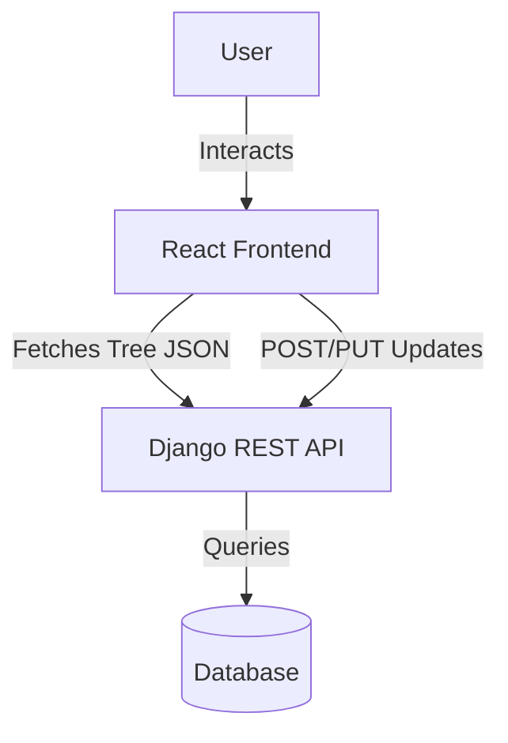
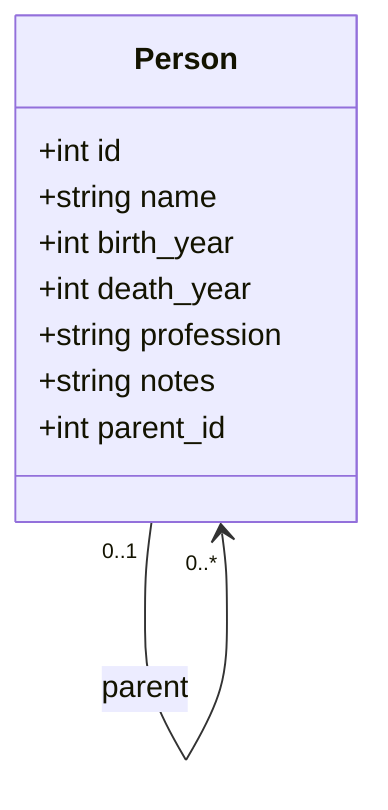

# Family Tree Maker - System Design Document

This document outlines the architecture, data structures, and implementation details for the Family Tree Maker web application.

## 1. System Architecture

The application will use a client-server architecture:
*   **Backend**: Django REST Framework (DRF) handling data persistence and API endpoints.
*   **Frontend**: React.js application fetching data and rendering the interactive tree.
*   **Database**: SQLite (local dev) or PostgreSQL (production) for storing relational family info.



## 2. Database Schema

The core of the application is a self-referencing `Person` model. This allows for an infinite hierarchy where each person points to their parent.

### Model: `Person`

| Field | Type | Description |
| :--- | :--- | :--- |
| `id` | UUID/Auto | Unique Identifier |
| `name` | CharField | Full Name |
| `birth_year` | Integer | Optional |
| `death_year` | Integer | Optional |
| `profession` | CharField | Optional |
| `notes` | TextField | Optional |
| `parent` | ForeignKey | References `Person` (self). Nullable (for root). |



## 3. API Design

We need an API that can return the data in a nested format suitable for recursive rendering.

### Endpoints
*   `GET /api/people/`: List all people.
*   `GET /api/tree/`: Returns the hierarchical JSON tree starting from root(s).
*   `POST /api/people/`: Add a new person.
*   `PUT /api/people/{id}/`: Update details.
*   `DELETE /api/people/{id}/`: Remove a person.

### Recursive Serialization
To generate the tree structure, the serializer will look up children dynamically.

**Response Structure (Example):**
```json
{
  "id": 1,
  "name": "Grandpa",
  "children": [
    {
      "id": 2,
      "name": "Dad",
      "children": [
        { "id": 4, "name": "Me", "children": [] },
        { "id": 5, "name": "Brother", "children": [] }
      ]
    },
    {
      "id": 3,
      "name": "Uncle",
      "children": []
    }
  ]
}
```

## 4. Frontend Implementation

The frontend will use React to recursively render components. The CSS strategy will be based on standard genealogy visualization techniques (using `<ul>` and `<li>` with pseudo-elements for connectors).

### Components
1.  **`FamilyTree` (Container)**: Fetches data from `/api/tree/` and handles the horizontal scrolling container.
2.  **`TreeNode` (Recursive)**:
    *   Renders the person's card (name, info).
    *   If `children` exist, renders a nested `<ul>` containing `TreeNode`s for each child.
    *   Connects to state management for "Add Child" or "Edit Person" actions.
3.  **`PersonForm`**: A modal or side panel to add/edit details.

### Visualization Logic
*   **HTML Structure**: Nested Unordered Lists (`<ul>`).
*   **CSS Connectors**: Use `::before` and `::after` pseudo-elements on `<li>` tags to draw the lines connecting parents to children.
*   **Styling**:
    *   Root node centered top.
    *   Children entered below using flexbox or absolute positioning logic within the list.
    *   Rounded cards with pastel backgrounds based on generation depth or fixed colors.

### Recursive Render Pseudocode
```jsx
const TreeNode = ({ person }) => (
  <li>
    <div className="person-card">
      {person.name}
      <button onClick={() => addChild(person.id)}>+</button>
    </div>
    {person.children && person.children.length > 0 && (
      <ul>
        {person.children.map(child => (
          <TreeNode key={child.id} person={child} />
        ))}
      </ul>
    )}
  </li>
);
```

## 5. UI/UX Design

*   **Color Palette**: Soft pastels to distinguish generations.
*   **Typography**: Clean sans-serif.
*   **Responsiveness**: The tree can grow very wide. The container will have `overflow-x: auto`.

## 6. Implementation Steps

1.  **Setup**: Initialize Django project and React app.
2.  **Backend**: Create `Person` model and recursive serializer.
3.  **API**: Implement ViewSets and URL routing.
4.  **Frontend**: Create basic recursive `TreeNode` component using mock data.
5.  **Integration**: Connect Frontend to Backend API.
6.  **Styling**: Apply the CSS connector lines and polished UI.
